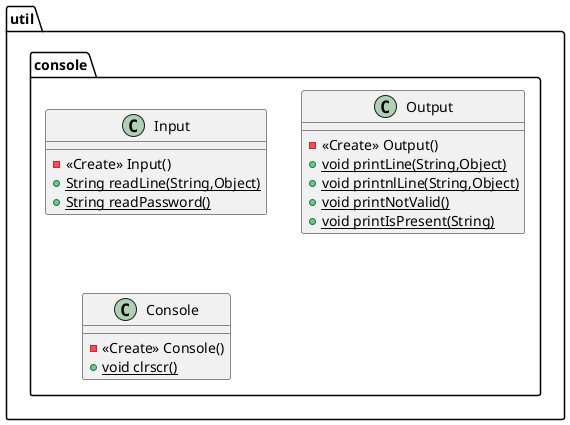

# 1. MyIOConsole

Questa piccola libreriua è stata costrutita per gestire gli aspetti legati agli Input/Output da console.

## UML

## Struttura

La libreria è composta da un solo _package_ contenenti 3 classi:
